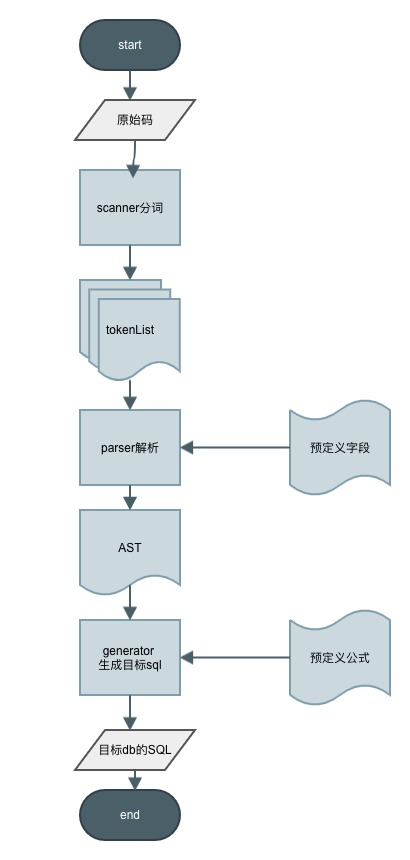
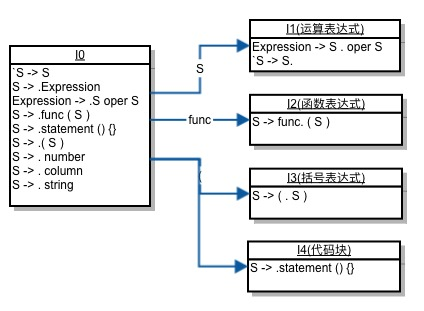
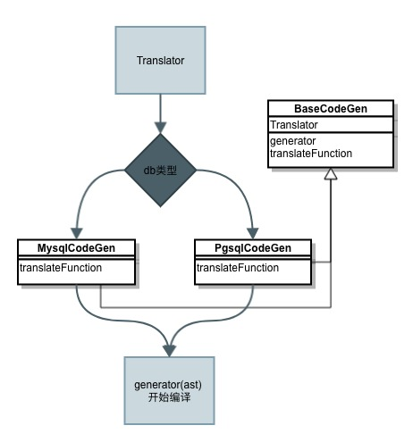

# sql-translation
 A pure PHP SQL parser to translate custom sql to MySQL or PostgreSQL
 
 ## 安装
 推荐使用composer进行安装，然后引用vendor/autoload.php即可
 > composer require zqx/sql-translation
 
 ## What
 * 将自定义的sql伪码转换成MySQL/PostgreSQL可执行sql代码；
 * 提供字段映射和校验，如传入公式为单字段：`[时间]`,通过转化生成数据表真实字段名`rectime`；
 * 由纯PHP代码组成，可通过composer或者下载引用，直接嵌入到现有的PHP服务中；
 
## Why
 1. 在BI系统或者和数据有关的场景下，需要让业务人员通过**动态写sql**进行查询，可以使用公式、运算符、字段、字符串、数字以及以上各种内容的组合来增强灵活性。
    * 期内充值：如数据为`新登时间:2018-10-01;时间:2018-10-03;金额:100.00`，由业务人员加上动态字段`date_diff(时间,新登时间)`识别每条充值记录为玩家新登第n日充值；
    * 权重分摊：如数据有`自营流水、联运流水、投入`等字段，每天的盈利计算公式为`自营+联运*20%-投入`；
 2. 针对同一个公式，需要保证均能正常翻译成MySQL或者PostgreSQL的执行代码，减少上层业务对下层db的直接依赖。
    * 例如拼接字符串函数：MySQL中为concat(str1, str2), PostgreSQL为(str1 || str2)
 3. 保证良好的安全性，避免通过动态sql直接穿透到代码执行区域，减少恶意的sql注入风险。
 4. 通过别名映射，如`rectime=>时间`展示给用户，避免用户直接拿到数据库真实字段名，同时还可以屏蔽不想被访问到的字段。

## How
1. 初始化
```
$translator = new Translator();
$columns = [
    [
        'alias' => '新登时间',
        'column' => 'first_login_time',
        'type' => Meta::DATA_TYPE_TIMESTAMP
    ],
    ...
];
// 设置参与编译的自定义字段
$translator->setColumns($columns);
```

2. 传入sql伪码进行编译
```
$input='date_diff([时间],[新登时间])';

// 默认MySQL编译得到:datediff(`retime`, `first_login_time`)
$mySqlDateDiff = $translator->compile($input)->translate();

// PostgreSQL环境下为:("retime"::date-"first_login_time"::date) 
$pgSqlDateDiff = $translator->compile($input)->translate(Translator::DB_PGSQL);
```

具体示例可看：[demo.php](https://github.com/grey-zeng/sql-translation/blob/master/example/demo.php)

更多进行sql编译的例子可看单元测试用例：[TranslatorTest.php](https://github.com/grey-zeng/sql-translation/blob/master/tests/TranslatorTest.php)

## 实现分析

### 流程图


### 步骤分析
#### 1. 分词

使用正则进行分词：
```
使用正则表达式来做nfa匹配
    const REG_EMPTY     = '/^([\s,]+)/';                                    // 空值或者逗号
    const REG_STATEMENT = '/^(while|declare)(\s)?\(/';                      // 预定义关键字，目前支持while和declare
    const REG_FUNCTION  = '/^(\w+)(\s)?\(/';                                // 函数，类似funcName(
    const REG_BRACKET   = '/^(\(|\))/';                                     // 左右括号
    const REG_COLUMN    = '/^(\[([\x{4e00}-\x{9fa5}a-zA-Z0-9_\-]+)\])/u';   // 匹配使用[]包含的自定义字段，需要使用Unicode解析中文
    const REG_NUMBER    = '/^((-?\d+)(\.\d+){0,1})/';                       // 正负整型及浮点数
    const REG_STRING    = '/^((\'|\")([\s\S]*?)(\2))/';                     // 使用""或者''闭合的字符串，需要非贪婪匹配
    const REG_OPERATOR  = '/^(\+|\-|\*|\/|(>|<)(=)?|=|\&+|\|+)/';           // 匹配操作符
    const REG_BRACE     = '/^({|})/';                                       // 匹配花括号
    const REG_VARIABLE  = '/^(@\w+)/';                                      // 运行时变量，如mysql的`select @num:=1`,其中的@num

$tokenList = [];
while (!empyt($str)) {
    foreach (REG_LIST as REG) {
        if preg_match(REG, $str) {
            $tokenList = 捕获的内容
            $str = substr($str, len(命中的内容)); // 向右遍历
        }
    }
}
```
得到tokenList：
```
这里的tokenList为{type:类型,val:值}组成的数组，将字符聚合成最小解释单元（空格和逗号将不记录）。
类型有：
    const TYPE_BRACKET_LEFT     = '(';          // 左括号
    const TYPE_BRACKET_RIGHT    = ')';          // 右括号
    const TYPE_COLUMN           = 'column';     // 使用[]标识的字段，比如[新登时间]
    const TYPE_NUMBER           = 'number';     // 数字，比如100、90.12
    const TYPE_STRING           = 'string';     // 使用单引号或者双引号标识的内容，比如'字符串1'
    const TYPE_OPERATOR         = 'operator';   // 运算符，比如+-*\或者><=等
    const TYPE_FUNCTION         = 'function';   // 以一连串字母和下划线组成的，带(标识的内容，比如`abs(...`将识别成abs和(两个token
    const TYPE_BRACE_LEFT       = '{';          // 左花括号
    const TYPE_BRACE_RIGHT      = '}';          // 右花括号
    const TYPE_VARIABLE         = '@';          // 变量
    // 以下用于解析复合语句
    const TYPE_ROOT             = 'root';
    const TYPE_BRACKETS         = 'brackets'; 
    const TYPE_EXPRESSION       = 'expr';  
    const TYPE_STATEMENT        = 'statement';  // 关键字,用于循环、分支、声明等操作

```

#### 2. 解析

语法分析使用从底向上的方式，定义S为原语，同时可以通过传入运算符、函数、括号、关键字生成4种状态的复合S。


```
// 由于存在类似S -> S oper S的左递归生成式，LL无法使用，而且LR暂时无法手写出来，改成了手动代码进行状态转移。
$tree = new Token(['type' => root]);
foreach ($tokenList as $token) {
    switch($token->type) {
        case 左括号
            if tree的末尾是函数 then 替换tree为函数节点进入I2
            else if tree的末尾是关键字 then 标识为代码块进入I4
            else 标识为括号表达式，进入I3
        case 右括号
            逐层判断父节点是否完毕，进行上升
        case 运算符
            标识为计算表达式，进入I1
        默认
            生成token并把token加到当前节点的子节点列表中
    }
}
```

示例
```
输入公式为：if(date_diff([时间],[新登时间])>3, "后期", "前期")
对应ast为
                       root
                         ↓
                      if:func
                         ↓
                  expr, 后期:str, 前期:str
                    ↓
   date_diff:func, >:oper, 3:num
       ↓
时间:col，新登时间:col

```

#### 3. 生成器

基础流程
```
function generator($token) {
    switch($token->type) {
        case 根节点 then 返回generator(token->child)
        case 函数 then 
            params=generator(token->child)      // dfs解析参数
            token->checkParam()                 // 进行函数参数校验
            返回translatFunciton(token, params)  // 不同的db不同处理
        case 计算表达式 then 
        caes 自定义字段 then 返回真实物理字段，没有则报错
        case 字符串/数字 then 返回内容
        case 变量 then 返回转码后的变量别名，防止被攻击
        case 代码块 then                        // 思路为根据不同的关键字定义不同的生成规则
            switch 关键字
                case while 实现了循环
                case declare 实现了变量声明和赋值
    }
}
```

针对不同db生成不同的函数目标码


```
/**
 * @param string $funcName 函数名
 * @param array $params [[val=>参数sql, type=>数据类型], ... ]
 */
function translatFunciton($funcName, $parmas) {
    // 显示指定函数对应的转化规则
    switch ($funcName) {
        case 函数名: 返回`函数名(预定义参数, 参数sql1, 参数sql2, ...)` 
        case 其他: 返回自定义规则，比如携带自定义参数、改写函数名等
    }
}
```
## 版本记录

### v1.0
第一个版本：支持函数、字段、运算符等组合的单sql转化。

### v1.1
把原有的分词器实现从直接扫描法升级为使用正则扫描。

### v1.2
新增循环、声明和变量等语句的支持。