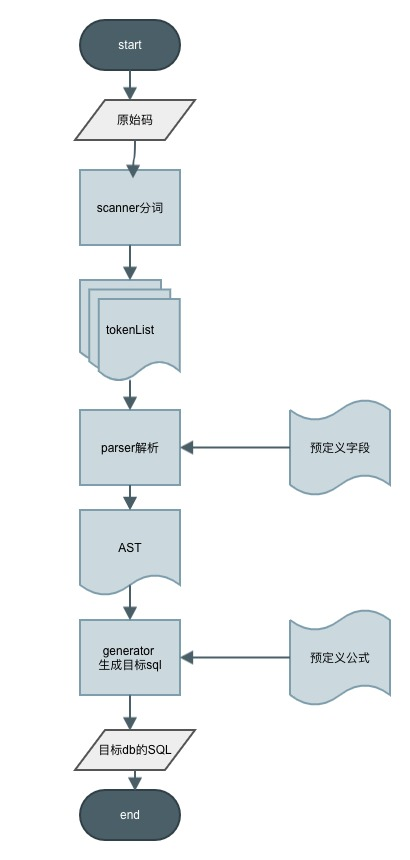
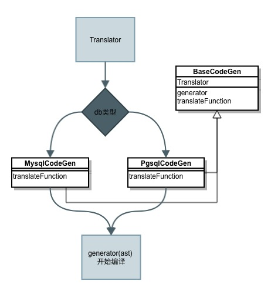

# 实现分析

## 流程图


## 步骤分析
### 1. 分词

分词采用直接扫描法：
```
$tokenList = [];
for($i; $i < len($str), $i++) {
  if 是数字 then 向右扫描,将整个数字塞入tokenList
  else if 是运算符or括号 then 塞入tokenList
  else if 是字符串 then 
     if 判断后面带( then 标识为函数
     else 标识为字符串
  else if 为[开头 then 向右偏移找到]，标识为字段
  else ...
}
```
得到tokenList：
```
这里的tokenList为{type:类型,val:值}组成的数组，将字符聚合成最小解释单元（空格和逗号将不记录）。
类型有：
    const TYPE_BRACKET_LEFT     = '(';          // 左括号
    const TYPE_BRACKET_RIGHT    = ')';          // 右括号
    const TYPE_COLUMN           = 'column';     // 使用[]标识的字段，比如[新登时间]
    const TYPE_NUMBER           = 'number';     // 数字，比如100、90.12
    const TYPE_STRING           = 'string';     // 使用单引号或者双引号标识的内容，比如'字符串1'
    const TYPE_OPERATOR         = 'operator';   // 运算符，比如+-*\或者><=等
    const TYPE_FUNCTION         = 'function';   // 以一连串字母和下划线组成的，带(标识的内容，比如`abs(...`将识别成abs和(两个token
    const TYPE_STATEMENT        = 'statement';
    // 以下用于解析阶段标识
    const TYPE_ROOT             = 'root';
    const TYPE_BRACKETS         = 'brackets'; 
    const TYPE_EXPRESSION       = 'expr';  

```

### 2. 解析

生成ast
```
$tree = new Token(['type' => root]);
foreach ($tokenList as $token) {
    switch($token->type) {
        case 左括号
            if tree的末尾是函数 then 替换tree为函数节点并进行下降
            else 标识为括号表达式，也进行下降
        case 右括号
            逐层判断父节点是否封闭，进行上升
        case 运算符
            标识为计算表达式，合并节点内容
        默认
            生成token并把token加到当前节点的子节点列表中
    }
}
```

示例
```
输入公式为：if(date_diff([时间],[新登时间])>3, "后期", "前期")
对应ast为
                       root
                         ↓
                      if:func
                         ↓
                  expr, 后期:str, 前期:str
                    ↓
   date_diff:func, >:oper, 3:num
       ↓
时间:col，新登时间:col

```

### 3. 生成器

基础流程
```
function generator($token) {
    switch($token->type) {
        case 根节点 then 返回generator(token->child)
        case 函数 then 
            params=generator(token->child)      // dfs解析参数
            token->checkParam()                 // 进行函数参数校验
            返回translatFunciton(token, params)  // 不同的db不同处理
        case 计算表达式 then 
        caes 自定义字段 then 返回真实物理字段，没有则报错
        case 字符串/数字 then 返回内容
    }
}
```

针对不同db生成不同的函数目标码

```
/**
 * @param string $funcName 函数名
 * @param array $params [[val=>参数sql, type=>数据类型], ... ]
 */
function translatFunciton($funcName, $parmas) {
    // 显示指定函数对应的转化规则
    switch ($funcName) {
        case 函数名: 返回`函数名(预定义参数, 参数sql1, 参数sql2, ...)` 
        case 其他: 返回自定义规则，比如携带自定义参数、改写函数名等
    }
}
```